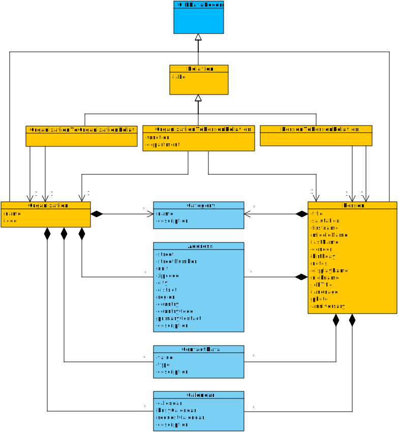

**Table of Contents**
<!-- TOC depthFrom:1 depthTo:6 withLinks:1 updateOnSave:1 orderedList:0 -->

- [Introduction](#introduction)
- [Basic Ideas](#basic-ideas)
	- [Duplicates](#duplicates)
	- [Relations](#relations)
- [Operations](#operations)
- [Content](#content)
	- [UML Diagram](#uml-diagram)
	- [JSON Schema](#json-schema)
	- [Description Table](#description-table)
- [Additional Content](#additional-content)

<!-- /TOC -->
# Introduction

In the following the master data model for the domain addresses is explained in detail. As for every Open Integration Hub Master Data Model, an UML class diagram, a JSON schema as well as a description table exists.

# Basic Ideas

The master data model for the addresses consists of different types of objects. We named them organizations and persons with reference to the real world objects.

Organizations can be companies or associations. Persons can be contacts in organizations or employees of your own company.

With this dividing in persons and organizations we are able to solve different problems and use cases, so we can assign for example a different amount of persons to an organization, can assign on person to different organizations or can assign relations between persons.

From this real world view we derive the two main objects and go deeper in the modeling.

## Duplicates

There are some use cases where traditional data models are having problems. For example you
have a person, who occupies different roles in different organizations and you must be able
to get in contact with this person over the right contact channel. So you have a person
who is the ceo in a company you are dealing with and he is also in the board of an association.
If you want to mail him infos in his role as a CEO you want to use the company mail address
and if you want to mail him as a board member, you want to use the mail address from the association.
Some tools will use a label for different kind of mail accounts, but this does not scale.

Other problems raised by use cases, for example about the different locations of one organization, the structure of a group of companies etc., arise the same questions.

Our solution to solve this problem is by allowing duplicates and link them by our relation modeling.

## Relations

Dealing with relations is a crucial requirement in the address management.

Generally there are three types of relations:
- Persons to organizations
- Persons to persons
- Organizations to organizations

If the task would only be a relation between the two objects persons and organizations, we could directly link them together. But we need a naming of this relation and users want to categorize single entries for the description of the relations of a users own organization to other organizations or persons or to see the function of a person in his organization. Therefore we need a more generic approach for storing relations, categories, tags or other distinguishing features. That's the reason, why we introduce a specific object for this.

# Operations
CRUD functionalities can be performed based on the model.

# Content

## UML Diagram

## JSON Schema

- `Person` Schema: [personV2](../../src/main/schema/addresses/personV2.json)
  - Technical description of a person object
- `Organization` Schema: [organizationV2](../../src/main/schema/addresses/organizationV2.json)
  - Technical description of an organization object
- `Relation` Schema: [relationV2](../../src/main/schema/addresses/relationsV2.json)
  - Technical description of a relation object
- `Shared Definitions` Schema: [shared-definitionsV2](../../src/main/schema/addresses/sharedDefinitionsV2.json)
  - Technical description of shared definitions of persons and organizations

## Description Table

In addition to the uml class diagram, this folder contains a [description table](AddressModelV2Description.md) which includes the following information for each attribute:
- Type
- Properties
- Short description
- Example values
- Enumeration options (if attribute is an enumeration)

# Additional Content

- `MappingTableSnazzyContactsAddressModel.md`: A concrete mapping between the data model of SnazzyContacts and the master data model for addresses.
