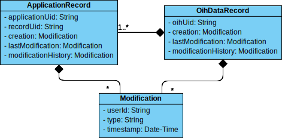
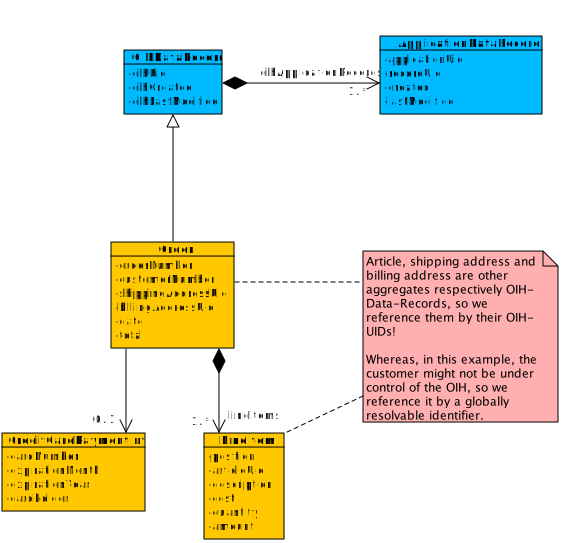

# Master Data Models

<!-- toc -->
  * [1. Preface](#1-preface)
  * [2. What is a Master Data Model?](#2-what-is-a-master-data-model-)
  * [3. Structure](#3-structure)
    + [3.1 Aggregates](#31-aggregates)
  * [4. Global Rules and Regulations for OMDMs](#4-global-rules-and-regulations-for-omdms)
    + [4.1 OIH Data Records](#41-oih-data-records)
    + [4.2 JSON-Schema](#42-json-schema)
      - [4.2.1 Making a sub-model of an OMDM an OIH Data Record on the schema level](#421-making-a-sub-model-of-an-omdm-an-oih-data-record-on-the-schema-level)
  * [5. Example: the Order aggregate](#5-example--the-order-aggregate)
  * [6. Rules and Regulations for OMDMs provided by the OIH community](#6-rules-and-regulations-for-omdms-provided-by-the-oih-community)
    + [6.1 Naming Conventions](#61-naming-conventions)
      - [6.1.1 Types and Properties](#611-types-and-properties)
      - [6.1.2 JSON-Schema](#612-json-schema)
    + [6.2 UML Class Diagrams](#62-uml-class-diagrams)
    + [6.3 Clarify all further aspects of a model with diagrams and/or textually](#63-clarify-all-further-aspects-of-a-model-with-diagrams-and-or-textually)
<!-- end toc-->

## 1. Preface

The Open Integration Hub (OIH) provides an asynchronous way of integrating applications and services. Modelling data which is processed by an OIH instance must always consider this fact!

One consequence is, that it must be possible to send data records to and receive them from an OIH without the need or even possibility for the receiver to eagerly fetch referenced further records of any kind through an API or data store (like the (optional) OIH Data Hub).

This is where the OIH's _Master Data Models_ come into play:

## 2. What is a Master Data Model?

There is not _the one_ canonical data model for the OIH as such a canonical data model would result in massive communication effort, idle times and workarounds. Instead a model for each context (domain) is defined:

* __An OIH Master Data Model (OMDM) describes the data of a certain domain in a depth which is sufficient enough to map and synchronize the specific data of multiple applications in that domain.__

In other words, an OMDM is a generic data model in the context of a specific domain, which is designed to cover, if possible, all content-related requirements of the applications integrated with the model. It should be designed with following criteria in focus:

- All use cases for the different integration scenarios between the involved applications can be matched and the data of all those applications can be mapped to the model.
- The model is generic and it can be extended on the application level.

Using the OIH's (optional) _Data Hub_, a OMDM enables a _Master Data Management_ for the respective domain by centrally storing the data of the integrated applications.

## 3. Structure

A data model representing a certain professional domain normally consists of numerous entities. Hence, it is necessary to split such a data model into smaller parts to enable the transfer of optimized amounts of data through an OIH:

* __Every OMDM consists of one or multiple _loosely coupled_ sub-models.__

Although it is necessary to split (especially big) data models into smaller sub-models, it often does not make sense to send each entity on its own, when there is a _high cohesion_ between certain entities. Hence,

* __each sub-model of an OMDM can consist of one _or more_ entities.__

### 3.1 Aggregates

* __In case a sub-model consists of multiple entities, it *must* be modeled as an _aggregate_:__

> __Aggregate__ is a pattern in Domain-Driven Design. A DDD aggregate is a cluster of domain objects that can be treated as a single unit. An example may be an order and its line-items, these will be separate objects, but it's useful to treat the order (together with its line items) as a single aggregate.
>
> An aggregate will have one of its component objects be the aggregate root. Any references from outside the aggregate should only go to the aggregate root. The root can thus ensure the integrity of the aggregate as a whole.
>
> [s. [Martin Fowler: DDD_Aggregate](https://martinfowler.com/bliki/DDD_Aggregate.html)]

## 4. Global Rules and Regulations for OMDMs

To enable the OIH to follow its purpose, the data records being processed have to fulfill some criteria and follow some rules. Some of these rules have to be applied already on the modelling level.

### 4.1 OIH Data Records

An OIH expects and needs, depending on the scenario and the involved components (e.g. with or without a Data Hub involved), more or less meta data on a data record to integrate two or more applications. This is achieved by modelling each sub-model of an OMDM as a so called _OIH Data Record_. The OIHDataRecord defines a superset of mandatory and optional (meta) data for records processed by an OIH instance:



* __Each of the the sub-models of a OMDM has to be marked as an *OIHDataRecord*.__

I.e., the root of an OMDM's sub-model **must** inherit from / extend _OIHDataRecord_, no matter whether it is modeled as an 
aggregate or as a single entity.

* __Every record passed into an OIH instance must at least be provided with a reference to the record of the application or service being the source of the record__,

called an _OIHApplicationDataRecord_ containing ... 

+ the OIH's identifier for the application, 
+ the record's ID within the application (both mandatory) and
+ optionally its creation and last modification dates within the application.

When receiving such a record from an OIH, there might also be entries of other applications being part of the integrations scenario with the same OMDM in the same OIH.

Additionally, depending on the scenario and the involved components again, the OIH itself or a connector (according to rules provided by the OIH __==> TO BE DISCUSSED!__) may also provide an OIH-internal UID for the record, along with the creation and last modification dates of the record within the OIH.

### 4.2 JSON-Schema

The OIH specifies JSON as the format that data is processed with. Accordingly,

* __[JSON Schema](http://json-schema.org) is the given format to describe OMDMs__

in a way an OIH instance is able to validate data at runtime. And, as OMDMs are split into sub-models and the records of those sub-models must be processable independently,

* __for every sub-model of an OMDM there must be a _seperate_ JSON schema describing the entity or aggregate.__

As there are situations where entities are reused in (i.e. are part of) two or more aggregates, it is of course adequat to encapsulate those entities in an additional schema file and reference them from the several sub-models to avoid redundancy.

#### 4.2.1 Making a sub-model of an OMDM an OIH Data Record on the schema level

There is a predefined JSON-Schema defining the OIHDataRecord (s. [oih-data-record.json](../src/main/schema/oih-data-record.json)).

* __Every sub-model of an OMDM must reference the OIHDataRecord schema and "inherit" from the defined type.__

This is done by adding an `allOf`-element to every sub-model's schema:

```javascript
{
  "$schema": "http://json-schema.org/schema#",
  "$id": "http://example.com/schemas/oih/my-model.json",
  "title": "MySubmodelAggregate",
  "allOf": [
    {
      "$ref": "http://openintegrationhub.org/schemas/oih-data-record.json"
    }
  ],
  "properties": {
    ...
```

## 5. Example: the Order aggregate

For a sales application, one could split the data model at least into the following sub-models, each of which built as an aggregate:

* Order
* Address
* Article
* ...

As an example to model an aggregate capable of being processed of an OIH instance, the following diagram shows a simplified order with its line items:



The Order's root defines the model as an OIH Data Record by extending it. This way, the _Order_ entity is the one and only entry point to the aggregate.

The JSON schema for this example is accessible [here](../src/examples/schema/order.json).

## 6. Rules and Regulations for OMDMs provided by the OIH community

The OIH is an open-source platform maintained by the cloud community under the leadership of the [Cloud Ecosystem](http://www.cloudecosystem.org). It can be run with any model which is designed and implemented by the rules and regulations listed so far.

In addition to the OIH platform itself, the OIH community also provides and maintains a number of concrete Master Data Models to be used by any OIH instance, such as models for contacts/addresses or products.

For these models, there are some further rules and regulations to follow in order to be presented in a unified way. This helps to understand and, above all, use them (i.e., implementing OIH Connectors for applications to be integrated with - respectively via - an OIH).

### 6.1 Naming Conventions

#### 6.1.1 Types and Properties

* __All type and property naming has to be in CamelCase:__
	* Type names are always spelled in _upper_ camel case (e.g., UpperCamelCaseType).
	* Property names are always spelled in _lower_ camel case (e.g., lowerCamelCaseProperty).
* __All type and property naming has to be done in English language.__
* __The prefixes _OIH_ and *OIH_*  (or _oih_ and *oih_* for properties) are reserved for types and properties of OIH related Types and fields and my not be used for definitions in concrete models.__

#### 6.1.2 JSON-Schema

* __Schema file names are always lowercase__.
* __As a seperator within file names a hyphen (-) may be used__ (e.g. _some-schema.json_).
* __The schema-ID (the _$id_ property in a JSON-Schema) is always structured as follows:__
	* The global context is _http://openintegrationhub.org/schemas/_
	* followed by a context directory and the name of the schema file (including the _.json_ suffix)
	
	Example: ```"$id": "http://openintegrationhub.org/schemas/products/product.json"```
* __Every field in a JSON-Schema must have a _description_ property__, as long as it's (even potentially) not self-explanatory	.

### 6.2 UML Class Diagrams

* __Every OMDM must be depicted by one or more UML Class Diagrams__, which illustrate the static aspect of the model. I.e., amongst others:
	* of which different OIH Data Records and entities (types) the OMDM constists,
	* how every OIH Data Record itself is composed,
	* how the OIH Data Records are related to each other,
	* which properties every entity (type) has.
* __Every OIH Data Record is defined by a Generalization relation__ (_OIHDataRecord_ is modelled as the superclass of the respective sub-model, s. [5. Example: the Order aggregate](#5-example--the-order-aggregate)).
* __Property types may, but must not be declared__ in the diagrams as the main purpose of these diagrams is to clarify the structure of an OMDM.

### 6.3 Clarify all further aspects of a model with diagrams and/or textually

Schemas and class diagrams only point out static aspects of a data model. Normally, there are further (e.g. dynamic) aspects of a model, that those descriptions do not point out (e.g. the conscious acceptance of redundancy). To enable ISVs and any other developers to understand and work with an OMDM,

* __all relevant aspects of a model, that are not derivable from JSON-Schemas or UML Class Diagramms have to be described textually and by further illustrations of any kind.__